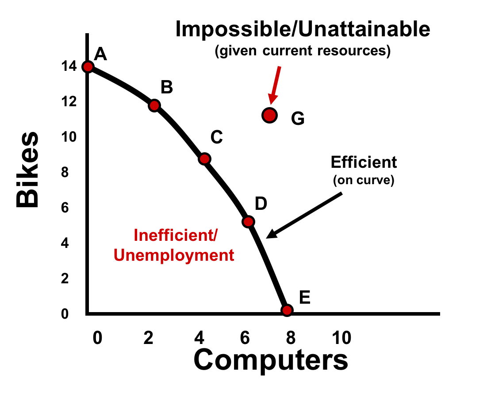
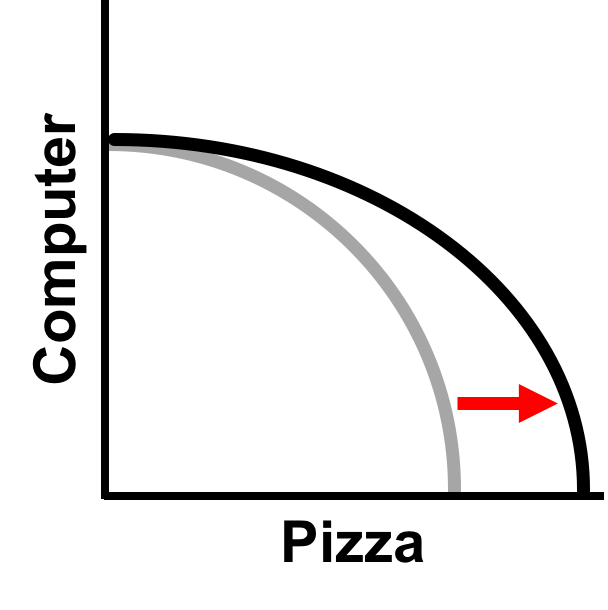
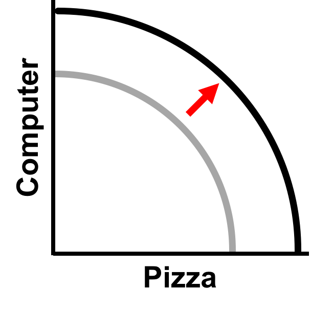
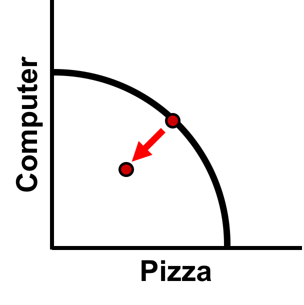

# 1.3 Production Possibilities Curve (PPC)

**Words** lead to **Numbers** which helps us create **Graphs** leading us to **Generalizations**.

- Graph & chart model showing alternative ways to show scarce resources.
- 4 Key Assumptions: only 2 goods, full employment, fixed resources, and fixed technology.
- Demonstrates scarcity, trade-offs, opportunity costs, and efficiency (possible free response question)
- Each point represents a specific combination of goods that can be produced given full employment of resources.

Here's an example showing **Increasing Opportunity Cost** (notice the curve) and the different production possibilities within a curve:

- Outside curve = Unattainable because of scarcity
- On curve = Most efficient use of resources and full employment
- Inside curve = Inefficient use of resources and unemployment

| Item | A | B | C | D | E |
| -- | -- | -- | -- | -- | -- |
| :bike: Bike | 14 | 12 | 9 | 5 | 0 |
| :computer: Computer | 0 | 2 | 4 | 6 | 8 |

Here's another example showing **Constant Opportunity Cost** (notice the straight line):

| Item | A | B | C | D | E |
| -- | -- | -- | -- | -- | -- |
| :pizza: Pizza | 0 | 1 | 2 | 3 | 4 |
| :egg: Calzone | 4 | 3 | 2 | 1 | 0 |

:capper: See ACDC comparison to Monsters Inc: https://www.youtube.com/watch?v=tW4G5IPpzFY

## 2 Types of Efficiency

1. **Productive Efficiency** is a product produced in the least costly way, anywhere on curve.
1. **Allocative Efficiency** is production based on demand of society, preferably on curve.

## 3 Shifters of Curve

1. Change in resource quality or quantity
2. Change in technology
3. Change in trade

What if pizza oven technology improved? More pizzas can be produced efficently.

What if overall population increased? There are more resources to produce more of everything!

It is important to note the distinctions between shifting the entire curve and moving along/within the curve! What if there's unemployment? The curve doesn't shift, since the curve shows maximum use of resources. Instead, the point in inside the curve.

